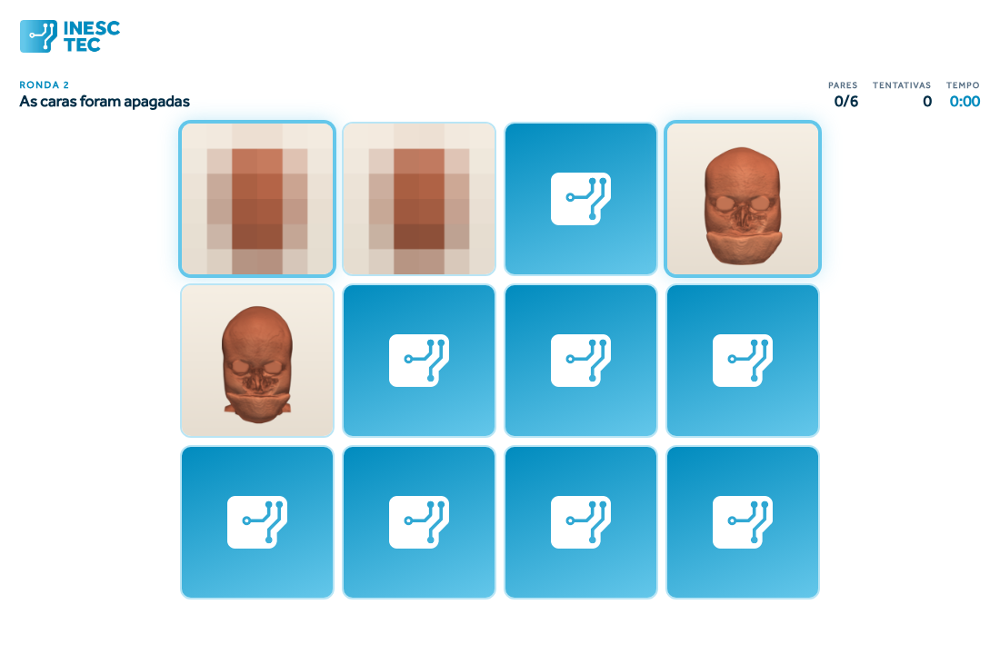

# Cara a Cara

A memory game that shows, in two minutes, why medical images need to be
anonymised. The cards are faces reconstructed from real head MRI scans.



*Round 2, easy difficulty, whole-head framing. In this picture the original
faces are pixelated on purpose; in the game they are shown as acquired.*

The game interface is in Portuguese; it was built as an outreach activity for
primary-school children and the general public.

---

## How it works

The game is played twice, against the clock:

1. **Round 1 — normal faces.** Each person appears on two cards. Pairs are
   found easily: people recognise faces.
2. **Round 2 — anonymised faces.** Each person appears once as the original
   face and once after anonymisation. It is the same person, yet the pairs
   become very hard to find.

The difference between the two rounds is the lesson: a head MRI reconstructs
the face like a photograph, so removing the patient's name is not enough. Good
anonymisation makes one person indistinguishable from everyone else.

The anonymisation is done by **Algernon**, a facial anonymisation pipeline for
head MRI that segments the ears, eyes, nose and mouth and treats each of them
separately.

### Settings

From the **Definições** (settings) screen:

| Setting | Options | Effect |
|---|---|---|
| Board size | 3×4 to 6×6 | Pairs per round. The grid adapts to the screen. |
| Difficulty | hard / easy | **Hard:** the two cards of a pair are rendered from different angles. **Easy:** every card is frontal; in round 1 both cards of a pair are the same image. |
| Framing | face only / whole head | **Face only** hides the skull outline, which would otherwise be a cue to match cards without looking at the face. |

On the easy setting, the original and the anonymised card of a pair share the
same camera, so background noise, shoulders and head position are identical
on both. Use the hard setting and the face framing if the activity is meant to
measure difficulty rather than to let everyone finish.

### Results and curation

- Each finished game is saved automatically (name, time and attempts of each
  round). The **Resultados** screen can sort and filter them, edit names and
  delete entries.
- `/curadoria.html` lets you accept or reject each exam, one at a time. A
  rejected exam leaves the game entirely.

Results, settings and curation live in `state/`, which is never committed:
results contain participant names.

---

## Running the game

Requirements: Python 3.9+, a browser, about 1.5 GB of free disk, and an
internet connection for the first run.

```bash
git clone <this repository>
cd cara-a-cara
./setup.sh
```

`setup.sh` creates a Python environment, downloads the IXI scans the game
needs (it asks you to accept the IXI terms first), renders the original cards
locally, and starts the game at **http://127.0.0.1:8000**. The first run takes
roughly 10–20 minutes, depending on the connection; later runs skip what is
already done.

| Option | |
|---|---|
| `--yes` | accept the IXI terms without asking |
| `--tar FILE` | use an `IXI-T1.tar` you already downloaded |
| `--no-serve` | build everything without starting the game |
| `--lan` | open the game to the local network (see below) |

After the first run, start the game with `python3 serve.py` — the server only
uses the Python standard library.

**Headless Linux:** rendering needs a display. Install Xvfb (`apt install
xvfb`, `dnf install xorg-x11-server-Xvfb`); the scripts start it themselves.
**Windows:** run `setup.sh` from WSL or Git Bash.

### Playing on tablets or phones

`./setup.sh --lan` (or `python3 serve.py --lan`) opens the game to the local
network and prints the address to type on the other devices.

**Only do this on a network you trust.** The original cards are faces of real
people. On a public or shared network, create your own network with a phone
hotspot and connect the computer to it first. Event networks often isolate
devices from each other ("client isolation"); check with whoever runs the
network beforehand.

### Docker

The image contains the server and the page only — never cards or scans. Build
the cards on the host, then mount them:

```bash
./setup.sh --no-serve
docker compose up -d          # http://127.0.0.1:8000
```

On SELinux systems (Fedora, Rocky, RHEL) add `:Z` to both volumes in
`docker-compose.yml`.

---

## Data and licensing

**This repository contains no original face of anyone.** It contains:

- the code, under the [Apache 2.0](LICENSE) licence;
- 94 sets of **anonymised** renderings in `assets/anon/`, derived from the
  [IXI dataset](https://brain-development.org/ixi-dataset/) and distributed
  under [CC BY-SA 3.0](LICENSE-DATA), the IXI licence.

The original faces are rendered on your machine, from scans you download
yourself from the IXI project, under the IXI terms. They are written to
`ixi/` and `data/`, which git ignores. The reason is simple: a face
reconstructed from an MRI identifies the person by the face itself. Removing
the exam's name changes nothing, which is the whole point of the game. The
IXI licence covers copyright, not the consent of the people scanned, and a
public repository cannot be taken back once published.

**The anonymisation model is not published.** It was trained on ADNI data,
whose Data Use Agreement asks investigators to consider whether trained
weights could allow participant data to be reconstructed. Without the model,
the set of anonymised exams is fixed: the game uses these 94 and cannot
anonymise new scans.

**Two exams were excluded.** The project's own re-identification attack found
that, for two of the 96 IXI exams used in the dissertation, the anonymised
rendering could still be associated with the original. They are not part of
this repository.

The README picture is generated by a script (below) that pixelates every
original card inside the page before taking the screenshot.

---

## Repository layout

| Path | What it is |
|---|---|
| `setup.sh` | one-command setup: environment → IXI download → cards → game |
| `serve.py` | local server: game page, cards and a small API for results, settings and curation |
| `game/` | the game page (HTML, CSS, JavaScript) and the curation page |
| `assets/anon/` | the 94 anonymised card sets, committed |
| `scripts/download_ixi.py` | streams the IXI archive and keeps only the scans the game uses |
| `scripts/build_cards.py` | renders the original cards and writes `data/manifest.json` |
| `scripts/rendering.py` | camera poses, framings and rendering parameters shared by both halves |
| `scripts/export_anon_assets.py` | maintainer-only: how `assets/anon/` was produced |
| `tools/screenshot_readme.mjs` | regenerates `docs/ronda2.png` with original faces pixelated |
| `tools/foto.mjs` | screenshot of any screen, for checking layouts |

Generated and ignored: `ixi/` (scans), `data/` (cards and manifest),
`state/` (results, settings, curation).

### How the cards fit together

Each exam has 12 cards: 2 framings × 2 kinds (original, anonymised) × 3 poses.
The original cards are rendered from the downloaded IXI scan after
reorientation to RAS, with exactly the camera and lighting parameters used for
the anonymised ones, so the two halves of a pair match. `data/manifest.json`
lists an exam only when all 12 cards exist; the game reads the manifest, never
the folder, so an unpaired card can never reach the board.

### Regenerating the README picture

Needs Node.js 18+ and Chrome, Chromium or Edge (set `CHROME=/path/to/browser`
if it is not found):

```bash
python3 serve.py &
node tools/screenshot_readme.mjs
```

The script refuses to save if any original card was left unpixelated.

---

## Acknowledgements

Brain images from the IXI dataset, collected at Hammersmith Hospital, Guy's
Hospital and the Institute of Psychiatry, London, and made available by the
IXI project under CC BY-SA 3.0.

The INESC TEC logos in `game/brand/` are trademarks of INESC TEC and are not
covered by this repository's licences.
